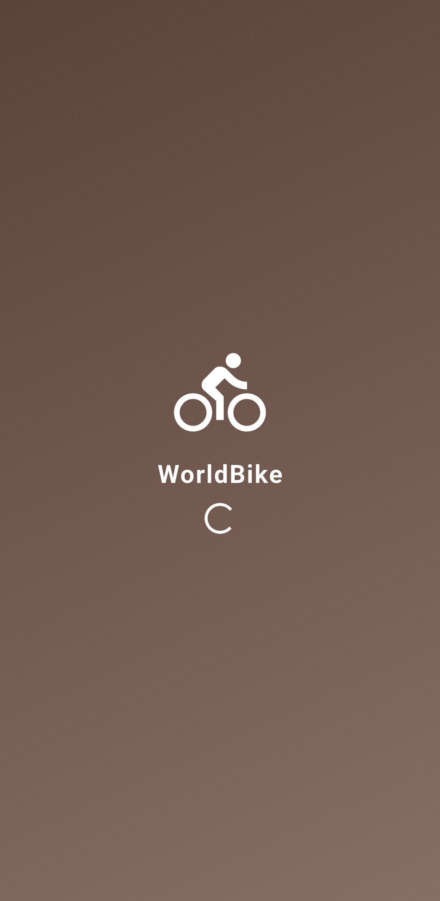
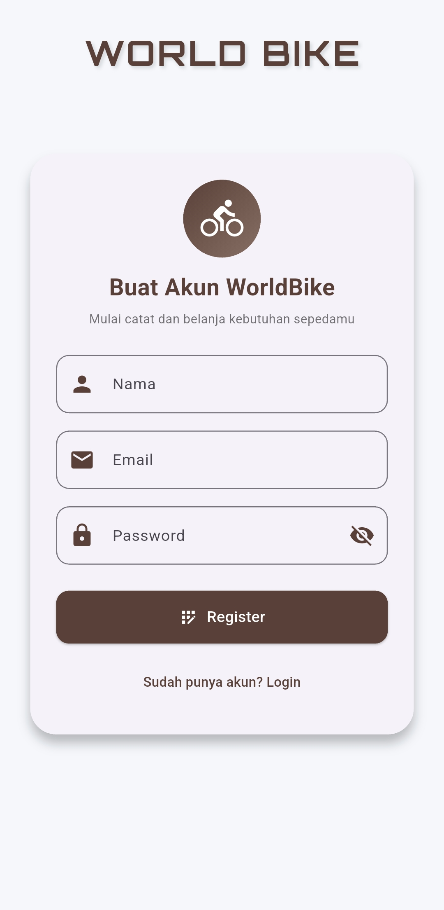

# UAS_Pemrograman-Mobile-2

## 🚴‍♂️ Aplikasi WorldBike

## 📖 Latar Belakang

Seiring meningkatnya kesadaran masyarakat akan pentingnya gaya hidup sehat dan ramah lingkungan, bersepeda menjadi salah satu aktivitas yang semakin diminati. Namun, pada praktiknya masih banyak pengguna sepeda yang mengalami kesulitan dalam memilih jenis sepeda yang sesuai, menemukan informasi yang relevan, hingga memantau aktivitas bersepeda mereka secara terstruktur.

Berdasarkan kondisi tersebut, saya mengembangkan sebuah aplikasi mobile bernama **WorldBike**. Aplikasi ini dirancang untuk membantu pengguna menjelajahi dunia bersepeda secara digital melalui informasi yang informatif, fitur yang interaktif, serta tampilan yang praktis dan mudah digunakan.

## 💡 Ide Proyek

WorldBike dirancang sebagai aplikasi yang menggabungkan unsur **edukasi, rekomendasi, dan pengalaman bersepeda** dalam satu platform. Aplikasi ini tidak hanya berfokus pada penyediaan informasi seputar sepeda, tetapi juga mendorong gaya hidup aktif melalui fitur-fitur pendukung yang membuat aplikasi terasa lebih hidup dan bermanfaat bagi pengguna.

Aplikasi ini mengusung tampilan modern dengan nuansa alam untuk memberikan kenyamanan visual serta pengalaman yang menyerupai aplikasi bersepeda profesional.

## 🎯 Tujuan

Tujuan dari pembuatan aplikasi WorldBike adalah:

* Membantu pengguna memilih sepeda sesuai dengan kebutuhan
* Mendorong gaya hidup sehat melalui aktivitas bersepeda
* Menyediakan informasi dan edukasi seputar dunia sepeda
* Memberikan pengalaman digital yang modern, interaktif, dan mudah digunakan

## 👥 Target Pengguna

* Penggemar sepeda
* Pemula yang ingin mulai bersepeda
* Komunitas gowes
* Masyarakat umum yang peduli terhadap kesehatan dan lingkungan

## 🧩 Fitur Utama

* Login dan autentikasi pengguna
* Kategori jenis sepeda (Gunung, Balap, Lipat, dan lainnya)
* Rekomendasi sepeda berdasarkan kebutuhan pengguna
* **Tracking aktivitas bersepeda** yang mencakup jarak tempuh, durasi, dan estimasi kalori untuk membuat aplikasi lebih interaktif
* Informasi manfaat bersepeda bagi kesehatan
* Marketplace sepeda dan aksesoris
* Profil pengguna
* Dashboard yang informatif dan mudah dipahami

## 🎨 Desain & Tampilan

WorldBike menggunakan konsep desain **modern, natural, dan minimalis** dengan dominasi warna coklat dan hijau yang merepresentasikan alam, petualangan, serta gaya hidup sehat. Desain ini bertujuan untuk memberikan kenyamanan visual sekaligus kemudahan navigasi bagi pengguna.

## 🛠️ Teknologi yang Digunakan

Aplikasi WorldBike dikembangkan menggunakan teknologi berikut:

* **Flutter** sebagai framework pengembangan aplikasi mobile
* **Dart** sebagai bahasa pemrograman utama
* **Firebase / Local Database** untuk pengelolaan data pengguna dan aktivitas

Teknologi tersebut dipilih agar aplikasi dapat berjalan dengan ringan, responsif, dan memiliki tampilan yang modern.

## 🧭 Alur Penggunaan Aplikasi

Secara umum, alur penggunaan aplikasi WorldBike adalah sebagai berikut:

1. Pengguna melakukan login ke dalam aplikasi
2. Pengguna masuk ke halaman dashboard utama
3. Pengguna dapat melihat kategori sepeda dan berbagai informasi terkait
4. Pengguna melakukan tracking aktivitas bersepeda
5. Pengguna dapat mengakses marketplace untuk melihat dan membeli sepeda maupun aksesoris
6. Pengguna dapat melihat riwayat aktivitas serta informasi akun melalui menu profil

Alur ini dirancang agar mudah dipahami dan digunakan oleh berbagai kalangan.

## 🌱 Manfaat dan Dampak Aplikasi

Dengan hadirnya aplikasi WorldBike, saya berharap aplikasi ini dapat memberikan manfaat sebagai berikut:

* Membantu pengguna menjalani gaya hidup sehat melalui aktivitas bersepeda
* Memberikan edukasi seputar dunia sepeda secara digital
* Mendorong penggunaan transportasi yang ramah lingkungan
* Menjadi media pendukung aktivitas olahraga sehari-hari

## 🔮 Pengembangan Selanjutnya

Ke depannya, aplikasi WorldBike masih dapat dikembangkan lebih lanjut dengan penambahan fitur seperti:

* Integrasi GPS untuk tracking rute secara real-time
* Fitur komunitas atau grup gowes
* Event dan tantangan bersepeda
* Sistem notifikasi pengingat aktivitas bersepeda

Pengembangan ini diharapkan dapat meningkatkan pengalaman pengguna serta memperluas fungsi aplikasi.

## 📦 Deployment

Pada proyek ini, saya memilih metode deployment dalam bentuk APK Android sesuai dengan opsi yang diberikan oleh dosen. Metode ini dipilih agar aplikasi dapat digunakan secara langsung pada perangkat Android dan memberikan pengalaman penggunaan yang lebih optimal sebagai aplikasi mobile.

## 🏁 Penutup

Melalui aplikasi WorldBike, saya berharap pengguna dapat lebih mudah mengenal, memilih, dan menikmati aktivitas bersepeda. Aplikasi ini menjadi salah satu bentuk penerapan teknologi mobile dalam mendukung gaya hidup sehat, aktif, dan ramah lingkungan di era digital.

## 🎥 Demo Aplikasi

Berikut merupakan video demo aplikasi WorldBike yang menampilkan alur penggunaan serta fitur-fitur utama yang telah dikembangkan.

*(Video demo aplikasi akan ditampilkan di bagian ini)*

## 🖼️ Tampilan Aplikasi

Berikut beberapa tampilan (screenshot) dari aplikasi WorldBike yang telah saya kembangkan, mulai dari halaman login, dashboard, hingga fitur utama aplikasi.

1. Splashcreen
    Menampilkan logo dan identitas aplikasi WorldBike sebagai pembuka sebelum pengguna masuk ke aplikasi.
   
   
3. Register
   Halaman pendaftaran akun untuk pengguna baru dengan mengisi data agar dapat menggunakan seluruh fitur aplikasi WorldBike.
   
   
4. Login
5. s
6. s
7. 
  
8. s
9. s
10. 
